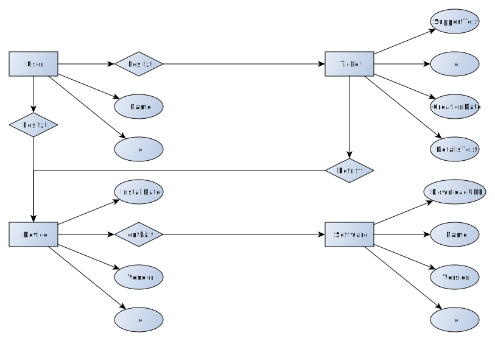
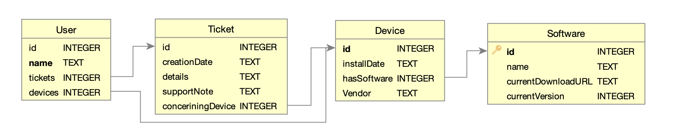

[//]: # (2022-11-16.08:45)
[//]: # (HWR>DSINFO)
[//]: # (Datenbanken)

## Abgabe Projektarbeit Paul Friedrich Vierkorn

# Aufgabe 1

In der Firma Biotronik gibt es ein automatisiertes Ticketsystem, welches Probleme mit der technischen Ausstattung der Mitarbeiter aufnimmt und für den IT-Support aufbereitet.

Das Ticketsystem der Biotronik basiert auf einem kommerziellen System, welches ebenfalls an das Inventarsystem angebunden ist.
Mithilfe dieser Anbindung können Geräte direkt verschiedenen Mitarbeiten zugewiesen werden.
Die verschiedenen Geräte haben verschiedenste Eigenschaften, zum Beispiel die Liste von installierter Software und Daten zur Hardware.

Durch diese Zusatzinformationen, die direkt an jedem Ticket hängen, kann der Support mögliche Rückfragen minimieren und die Effizienz erhöhen.

# Aufgabe 2



# Aufgabe 3



# Aufgabe 4

```sql
BEGIN TRANSACTION;
CREATE TABLE IF NOT EXISTS "Software" (
	"id"					INTEGER,
	"name"					TEXT,
	"currentDownloadURL"	TEXT,
	"currentVersion"		INTEGER,
);
CREATE TABLE IF NOT EXISTS "Device" (
	"id"			INTEGER,
	"installDate"	TEXT,
	"hasSoftware"	INTEGER,
	"Vendor"		TEXT,
	FOREIGN KEY("hasSoftware") REFERENCES "Software"("id")
);
CREATE TABLE IF NOT EXISTS "User" (
	"id"		INTEGER,
	"name"		TEXT,
	"tickets"	INTEGER,
	"devices"	INTEGER,
	FOREIGN KEY("devices") REFERENCES "Device"("id"),
	FOREIGN KEY("tickets") REFERENCES "Ticket"("id")
);
CREATE TABLE IF NOT EXISTS "Ticket" (
	"id"				INTEGER,
	"creationDate"		TEXT,
	"details"			TEXT,
	"supportNote"		TEXT,
	"conceriningDevice"	INTEGER,
	FOREIGN KEY("conceriningDevice") REFERENCES "Device" ("id")
);
COMMIT;

```

# Aufgabe 5

```sql
SELECT * FROM User WHERE name LIKE '%Vierkorn' and Device.id LIKE User.devices
SELECT name FROM Software WHERE currentDownloadURL LIKE 'http://%' AND Ticket.supportNote LIKE '%INSTALLATION%"
```